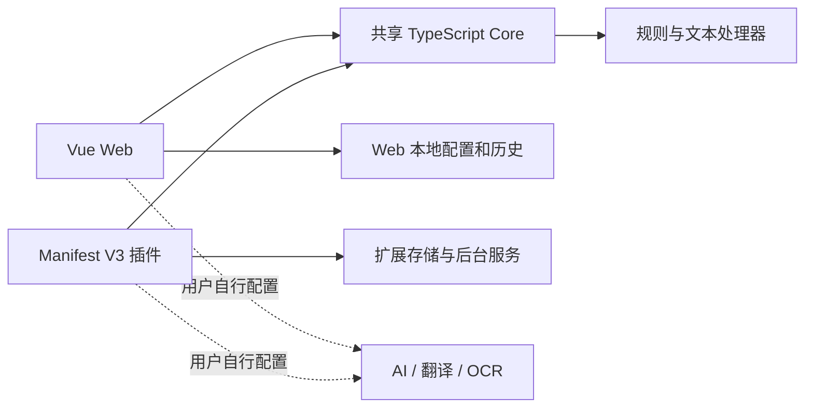

<div align="center">

# Text Assistant

**把复制来的文字，整理成可继续使用的内容。**

文本清洗 · 自定义规则 · AI 辅助阅读 · Web & Browser Extension

[](LICENSE)


[](https://github.com/CVBN7625/text-assistant/actions/workflows/ci.yml)

[功能概览](#功能概览) · [技术设计](#技术设计) · [快速开始](#快速开始) · [验证与边界](#验证与边界) · [参考与许可](#参考与许可)

</div>


<p align="center"><sub>本地运行的真实 Web 界面。输入取自项目说明，未配置或调用外部 API。</sub></p>

## 为什么做这个项目

用于整理从网页、PDF 或文献中复制的文本，把换行、空格、字符和引用格式处理组织为可组合的操作。重复步骤可以保存为规则，AI、翻译和 OCR 则作为按需配置的辅助能力。

项目包含共享处理核心、独立网页版和 Chromium 浏览器插件，适合个人使用与源码学习。基础文本处理无需密钥；外部服务采用使用者自行配置凭据的本地模式。

## 功能概览

| 能力 | 已实现内容 |
| --- | --- |
| 文本整理 | 换行与空格清理、全半角和繁简转换、引用及特殊字符处理，处理器可分别开关 |
| 规则组合 | 文本/正则替换、模板、优先级和处理前后阶段，支持保存与复用 |
| AI 辅助 | 自定义文本处理，兼容 OpenAI / Anthropic 风格协议，含输入限制、超时重试和 JSON 校验 |
| 阅读辅助 | 文本翻译、图片翻译与 OCR 页面及服务适配，需自行配置上游账号 |
| 两端体验 | Web 处理与历史记录；插件选区、剪贴板、右键和快捷操作 |
| 配置管理 | 两端独立保存配置；插件备份默认排除凭据，敏感导出需显式选择 |

<details>
<summary>查看自定义规则页面</summary>


规则按“处理前 → 内置处理器 → 处理后”组织，便于明确操作顺序。截图为本地实际页面。

</details>

## 技术设计



- **复用处理能力，隔离客户端状态。** Web 与插件依赖同一个 Core，各自管理配置和运行时存储。
- **用阶段和优先级表达处理顺序。** 自定义规则可在内置处理器之前或之后执行，避免靠点击顺序隐式组织流程。
- **把外部服务当作可失败的依赖。** AI 适配包含超时、重试和结果校验；模拟测试与真实集成分开说明。

| 层次 | 技术 |
| --- | --- |
| 界面 | Vue 3、Naive UI、TypeScript |
| 构建与协作 | Vite 5、pnpm workspace |
| 文本核心 | opencc-js、pangu、自定义处理器 |
| 浏览器扩展 | Chromium Manifest V3 |
| 验证 | Vitest、类型检查、ESLint、插件打包检查 |

```text
packages/core/       共享处理器、规则、配置与测试
packages/web/        Vue 页面和服务适配
packages/extension/  扩展页面、后台服务与 Manifest
scripts/             字体和插件打包工具
docs/                OCR 说明与真实截图
THIRD_PARTY_LICENSES/ 参考许可原文
```

## 快速开始

环境：Node.js 24、pnpm 11.5.2、现代 Chromium 浏览器。以下命令使用 Corepack；如系统没有该命令，先运行 `npm install --global corepack`。

```bash
git clone https://github.com/CVBN7625/text-assistant.git
cd text-assistant
corepack pnpm install --frozen-lockfile
corepack pnpm dev --host 127.0.0.1
```

打开 <http://127.0.0.1:3001>。开发脚本会先构建 Core，干净克隆无需手动调整包顺序。基础文本功能不需要 `.env`。

1. 在“文本处理器”勾选需要的处理器，例如“全角转半角”。
2. 输入 `ＡＢＣ１２３` 并点击“处理文本”，结果为 `ABC123`。
3. 在“历史记录”回看输入与结果，或在“自定义规则”保存常用步骤。
4. 需要 AI / 翻译 / OCR 时，再在本地设置页配置自己的服务与密钥。

<details>
<summary>生产预览与浏览器插件</summary>

```bash
corepack pnpm build
corepack pnpm --filter web preview --host 127.0.0.1
corepack pnpm package:extension:check
```

在 Chromium 扩展管理页开启开发者模式，选择“加载已解压的扩展程序”，指定 `packages/extension/dist`。插件构建和打包已验证，安装后的权限及完整运行流程尚未验收；项目未发布到扩展商店。

</details>

## 验证与边界

```bash
corepack pnpm verify
corepack pnpm package:extension:check
corepack pnpm font:check
```

2026-10-08 本地验证：三包类型检查、Lint、生产构建及 **178 项测试**通过（Core 121 / Web 16 / Extension 41）；文本转换、历史和主页面导航冒烟通过；插件打包与 26 个字体子集检查通过。Lint 保留 80 条既有警告，构建仍有 Vite CJS 弃用与大 chunk 提示。

真实 AI / 翻译 / OCR 调用依赖使用者配置、额度、网络和服务权限，尚未验证；Web 开发代理不包含在静态预览中，可能遇到 CORS 限制。完整规则编辑 UI 和插件安装后流程也未逐项验收。

密钥仅由使用者在本地填写，仓库没有开发者测试凭据。浏览器 localStorage / 扩展存储不是加密保险库；不要把密钥写入 `VITE_*`，不要提交配置导出或含密钥的截图。更多说明见 [本地使用边界](RELEASE_STATUS.md)。项目未验证患者信息处理或医院部署场景。

## 参考与许可

本项目代码和文档采用 [MIT License](LICENSE)，版权署名使用 GitHub 账号 `CVBN7625`。第三方依赖、字体与参考许可仍按各自条款适用。

- [CopyPlusPlus](https://github.com/CopyPlusPlus/CopyPlusPlus)：参考文本操作思路；语言编码映射的原始来源注释及 MIT 声明保留。
- [paper-assistant](https://github.com/laorange/paper-assistant)：参考论文文本处理思路。项目所有者确认没有复制或改编其代码；其 GPL-3.0 原文作为参考记录保留，不用于声明本项目整体许可。
- [LXGW WenKai Screen](https://github.com/lxgw/LxgwWenKai-Screen)：字体采用 SIL OFL 1.1，Webfont 包的 MIT 声明及来源说明保留在字体目录。

皮肤资源已由项目所有者确认是自制或 AI 生成且可公开使用。完整来源说明见 [THIRD_PARTY_NOTICES.md](THIRD_PARTY_NOTICES.md)；截图来源见 [截图记录](docs/SCREENSHOTS.md)。
