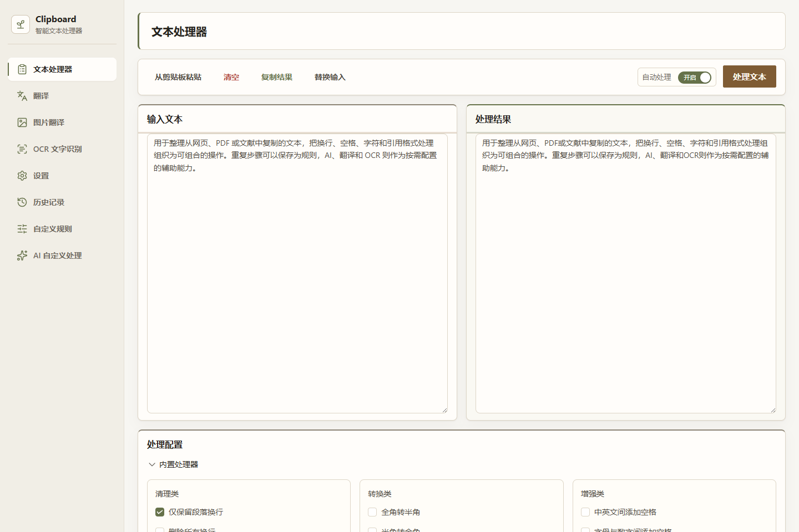
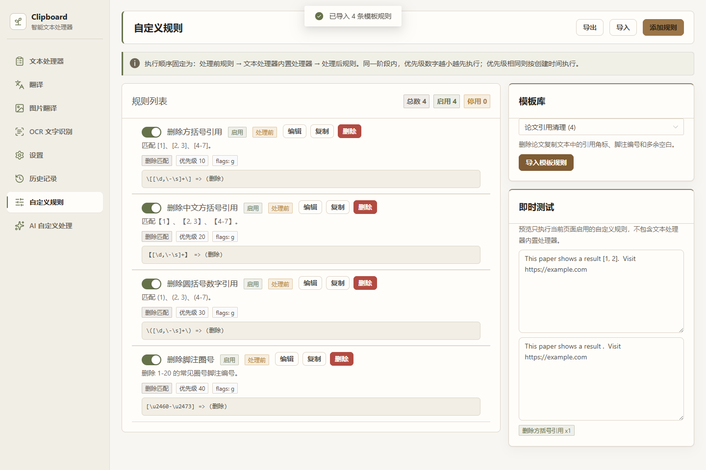
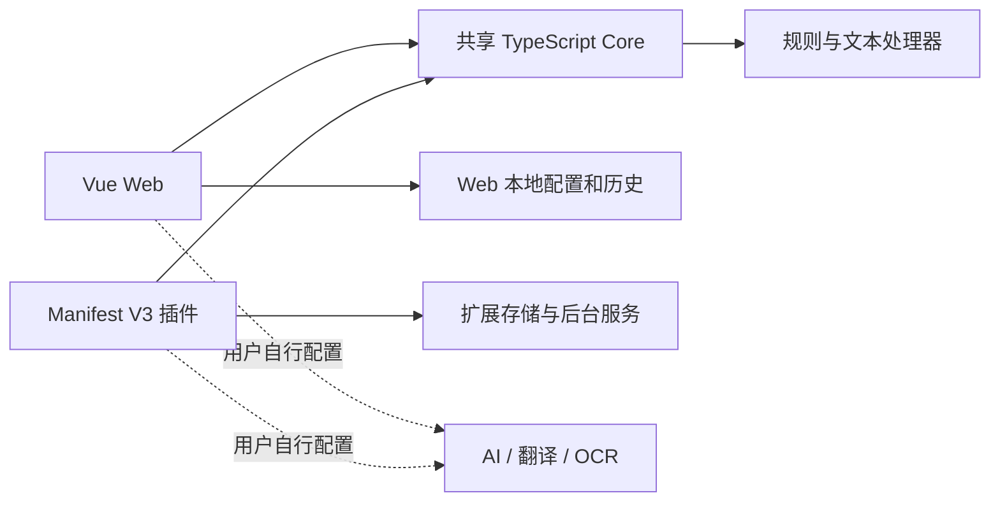

<div align="center">

# Text Assistant

**把复制来的文字，整理成可继续使用的内容。**

文本清洗 · 自定义规则 · AI 辅助阅读 · Web & Browser Extension

[](LICENSE)


[](https://github.com/CVBN7625/text-assistant/actions/workflows/ci.yml)

[功能概览](#功能概览) · [技术设计](#技术设计) · [快速开始](#快速开始) · [开发与测试](#开发与测试) · [参考与许可](#参考与许可)

</div>



<p align="center"><sub>文本处理界面：在同一页面查看输入、处理结果和处理器配置。</sub></p>

## 项目简介

用于整理从网页、PDF 或文献中复制的文本，把换行、空格、字符和引用格式处理组织为可组合的操作。重复步骤可以保存为规则，AI、翻译和 OCR 则作为按需配置的辅助能力。

项目包含共享处理核心、独立网页版和 Chromium 浏览器插件，适合个人使用与源码学习。基础文本处理无需密钥；外部服务采用使用者自行配置凭据的本地模式。

## 功能概览

| 能力 | 已实现内容 |
| --- | --- |
| 文本整理 | 换行与空格清理、全半角和繁简转换、引用及特殊字符处理，处理器可分别开关 |
| 规则组合 | 文本/正则替换、模板、优先级和处理前后阶段，支持保存与复用 |
| AI 辅助 | 自定义文本处理，兼容 OpenAI / Anthropic 风格协议，含输入限制、超时重试和 JSON 校验 |
| 阅读辅助 | 文本翻译、图片翻译与 OCR 页面及服务适配，需自行配置上游账号 |
| 两端体验 | Web 处理与历史记录；插件选区、剪贴板、右键和快捷操作 |
| 配置管理 | 两端独立保存配置；插件备份默认排除凭据，敏感导出需显式选择 |

<details>
<summary>查看自定义规则页面</summary>



规则按“处理前 → 内置处理器 → 处理后”执行，支持模板导入、独立启停和即时预览。

</details>

## 技术设计



- **共享处理核心。** Web 与插件依赖同一个 Core，各自管理配置和运行时存储。
- **规则执行顺序。** 自定义规则可在内置处理器之前或之后执行，避免靠点击顺序隐式组织流程。
- **外部服务适配。** AI 请求包含超时、重试和结果校验；服务配置分别保存在各客户端。

| 层次 | 技术 |
| --- | --- |
| 界面 | Vue 3、Naive UI、TypeScript |
| 构建与协作 | Vite 5、pnpm workspace |
| 文本核心 | opencc-js、pangu、自定义处理器 |
| 浏览器扩展 | Chromium Manifest V3 |
| 验证 | Vitest、类型检查、ESLint、插件打包检查 |

```text
packages/core/       共享处理器、规则、配置与测试
packages/web/        Vue 页面和服务适配
packages/extension/  扩展页面、后台服务与 Manifest
scripts/             字体和插件打包工具
docs/                OCR 说明与界面示例
THIRD_PARTY_LICENSES/ 参考许可原文
```

## 快速开始

环境：Node.js 24、pnpm 11.5.2、现代 Chromium 浏览器。以下命令使用 Corepack；如系统没有该命令，先运行 `npm install --global corepack`。

```bash
git clone https://github.com/CVBN7625/text-assistant.git
cd text-assistant
corepack pnpm install --frozen-lockfile
corepack pnpm dev --host 127.0.0.1
```

打开 <http://127.0.0.1:3001>。开发脚本自动构建共享 Core；基础文本功能不需要 `.env`。

1. 在“文本处理器”勾选需要的处理器，例如“全角转半角”。
2. 输入 `ＡＢＣ１２３` 并点击“处理文本”，结果为 `ABC123`。
3. 在“历史记录”回看输入与结果，或在“自定义规则”保存常用步骤。
4. 需要 AI / 翻译 / OCR 时，再在本地设置页配置自己的服务与密钥。

<details>
<summary>生产预览与浏览器插件</summary>

```bash
corepack pnpm build
corepack pnpm --filter web preview --host 127.0.0.1
corepack pnpm package:extension:check
```

在 Chromium 扩展管理页开启开发者模式，选择“加载已解压的扩展程序”，指定 `packages/extension/dist`。插件通过本地开发者模式加载，暂未提供扩展商店安装入口。

</details>

## 开发与测试

```bash
corepack pnpm verify
corepack pnpm package:extension:check
corepack pnpm font:check
```

`verify` 执行三包类型检查、Lint、单元测试及生产构建。测试覆盖文本处理器、规则服务、配置管理与外部服务适配；插件打包和字体资源由独立脚本检查。测试范围与兼容性记录见 [测试说明](docs/TESTING.md)。

### 使用说明

AI、翻译和 OCR 需要在本地设置中配置服务地址与凭据。网页使用 localStorage，插件使用扩展存储；密钥仅在调用对应上游时使用。配置导出默认排除凭据，敏感导出文件应单独保管。

Web 开发服务器提供部分翻译代理，静态预览不包含该代理；OCR 和自定义 AI 服务的可用性取决于上游权限、额度及 CORS 设置。详细配置与存储说明见 [本地配置](RELEASE_STATUS.md)。

## 参考与许可

代码和文档采用 [MIT License](LICENSE)。第三方依赖与字体遵循各自许可证。

- [CopyPlusPlus](https://github.com/CopyPlusPlus/CopyPlusPlus)：文本操作思路与语言编码映射参考。
- [paper-assistant](https://github.com/laorange/paper-assistant)：论文文本处理思路参考。
- [LXGW WenKai Screen](https://github.com/lxgw/LxgwWenKai-Screen)：界面字体，采用 SIL OFL 1.1；Webfont 包采用 MIT。

来源、许可文件及资源说明见 [第三方声明](THIRD_PARTY_NOTICES.md)。
